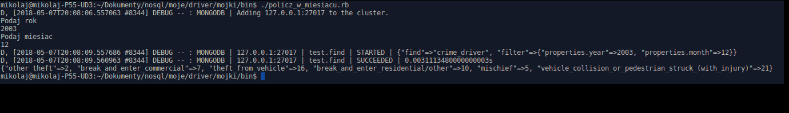

# Gierszewski Mikołaj

# Projekt_zaliczenie_nosql
## Ruby Driver

### Wykorzystane dane:
[Crime in Vancouver](https://www.kaggle.com/wosaku/crime-in-vancouver/data)

Data of crimes in Vancouver (Canada) from 2003 to 2017
Columns: 
1) TYPE - Type of Crime - string
1) YEAR - Year when the reported crime activity occurred - numeric
1) MONTH - Month when the reported crime activity occurred - numeric
1) DAY - Day when the reported crime activity occurred - numeric
1) HOUR - Hour when the reported crime activity occurred - numeric
1) MINUTE - Minute when the reported crime activity occurred - numeric
1) HUNDRED_BLOCK - Generalized location of the report crime activity - numeric
1) NEIGHBOURHOOD - Neighbourhood where the reported crime activity occurred - numeric
1) X - Coordinate values projected in UTM Zone 10 - numeric
1) Y - Coordinate values projected in UTM Zone 10 - numeric
1) Latitude - Coordinate values converted to Latitude - numeric
1) Longitude - Coordinate values converted to Longitude - numeric

|TYPE | YEAR | MONTH | DAY | HOUR | MINUTE | HUNDRED_BLOCK | NEIGHBOURHOOD | X | Y | Latitude |	Longitude
|-|-|-|-|-|-|-|-|-|-|-|-|	 		 	 	
Other Theft |	2003 |	5 |	12 |	16 |	15 |	9XX TERMINAL AVE |	Strathcona |	493906.5 |	5457452.47 |	49.26980201 |	-123.0837633|
Other Theft |	2003 |	5 |	7 |	15 |	20 |	9XX TERMINAL AVE |	Strathcona |	493906.5 |	5457452.47 |	49.26980201 |	-123.0837633|

## Przygotowanie json z pliku crime.csv
```bash
./generowanie_json.sh
```

## Import danych (wygenerowany json) do mongo:
```bash
./importowanie.sh
```

## Utworzenie geo-indeksu 
```bash
./ustaw_baze.rb
```
Tworzy geo_indeks potrzebny do skryptu punkty_w_okolicy.rb

```ruby
coll.indexes.create_one( { "location"=> "2dsphere" } )
```

## Wypisanie przestępstw w podanej okolicy
```bash
./punkty_w_okolicy.rb
```
Pobiera długosc i szerokość geograficzną od użytkownika i liczy ilość zbrodni w okolicy ("$minDistance" : 1000, "$maxDistance" : 5000). Następnie skrypt pyta użytkownika czy zapisac w kolekcji crime_export wyszukane zbrodnie.

```ruby
matched_crime = coll.find(
  {
    "location"=>
      { "$near"=>
        {
          "$geometry"=> { "type"=> "Point",  "coordinates"=> [ longitude_to_search.to_f, latitude_to_search.to_f ] },
          "$minDistance"=> 1000,
          "$maxDistance"=> 5000
        }
      }
   }
).limit(200).to_a
```

## Wyliczanie centroidy podanego prze użytkownika przestępstwa
```bash
./centroid_crime.rb
```
Pobiera typ zbrodni i liczy centroide danego typu przestępstwa. Następnie wynik zapisuję w kolekcji.

```ruby
ag = coll.aggregate([
	{"$match"=> {"properties.type_of_crime": type_to_search}},
  {"$replaceRoot"=> { newRoot: "$location" }},
  {"$project"=>	{ "type": 1, szerokosc: { "$arrayElemAt"=> [ "$coordinates", 0 ] },dlugosc: { "$arrayElemAt"=> [ "$coordinates", -1 ] }}},
  {"$group"=> { _id: type_to_search ,srednia_szerokosc: { "$avg" => "$szerokosc"}, srednia_dlugosc: { "$avg"=> "$dlugosc"} } }
] )
```

## Wyświetla liczbę zbrodni każdego typu w wybranym miesiącu
```bash
./policz_w_miesiacu.rb
```
Pobiera rok i miesiąc od użytkownika a następnie wyświetla ilość zarejestrowanych przestępstw w wybranym czasie.

```ruby
all_chosen_crimes = coll.find({ "properties.year"=> year_to_search.to_i,
"properties.month"=> month_to_search.to_i })

puts all_crimes.group_by{|e| e}.map{|k, v| [k, v.length]}.to_h
```



## Eksportuje dane z kolekcji crime_export do formatu geojson
```bash
./export_geojson.sh
```
 Utworzony zostaje plik crime.geojson
 
[Przykladowy GEOJSON](https://github.com/M111q/Projekt_zaliczenie_nosql/blob/master/data/crime.geojson)


